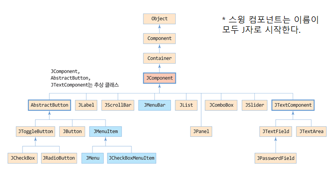
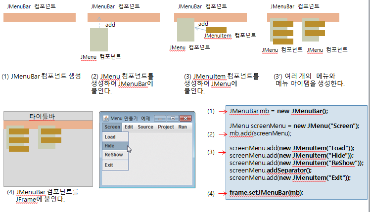
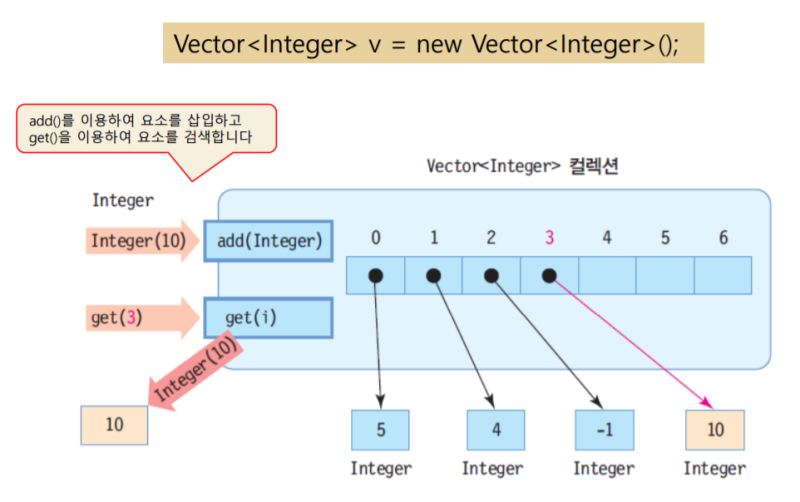
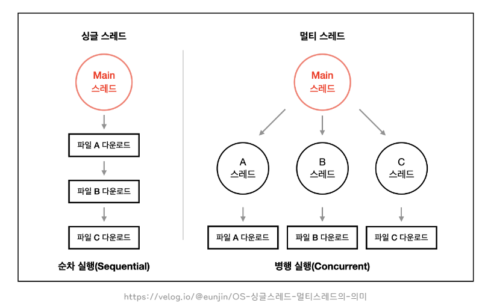
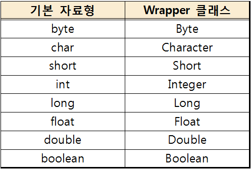
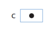
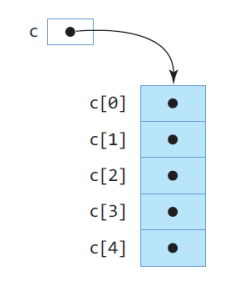
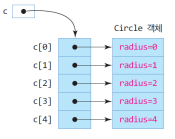

# 최상현 202030138

## 14주차 수업 내용(06.14)
1. 입출력 스트림 - 응용프로그램과 입출력 장치를 연결하는 소프트웨어 모듈
    * 문자 스트림 - 문자만 다룰 수 있기 때문에 문자가 아닌 데이터가 문자 출력 스트림에 입력되면 오류가 발생
    * 바이트 스트림 - 바이트를 단위로 다루는 스트림으로써 스트림에 들어오고 나가는 정보를 단순 바이트로 다루기에 문자든 이미지든 바이트든 흘려보낸다.

2. 스트림 연결

3. 텍스트 파일 읽기
    1. 파일 입력 스트림 생성 - 파일 입력 스트림을 생성하고, 파일과 연결한다.
        ```java
        FileReader fn = new FileReader("c:\\test.txt");
        ```
    2. 파일 읽기 - fin.read()는 파일로부터 문자 하나를 리턴하며, 파일의 끝(EOF)을 만나면 -1을 리턴한다.
        ```java
        int c;
        while((c = fin.read()) != -1) {
            System.out.print((char)c);
        }
        ```
    3. 스트림 닫기 - 스트림이 더 이상 필요 없게 되면 닫아야한다.
        ```java
        fin.close();
        ```

4. 파일 입출력 예외 처리

5. 텍스트 파일 쓰기

6. 바이너리 파일 쓰기
    1. 파일 출력 스트림 생성
        ```java
        FileOutputStream fout = new FileOutputStream("c:\\Temp\\test.out")
        ```
    2. 파일 쓰기
        ```java
        byte b[] = {7, 51, 3, 4, -1, 24};
        for(int i=0; i<b.length; i++) {
            fout.write(b[i]);
        }
        또는
        fout.write(b);
        ```
    3. 

7. sd

8. File 클래스
    * 파일이나 디렉토리에 대해 경로명, 파일 크기, 파일 타입, 파일 수정 날짜 등 파일에 관한 속성 정보를 제공
    * 파일 관리 작업 지원
    * 파일 크기와 타입을 알아내고, 파일 삭제, 이름 변경, 디렉토리 생성, 디렉토리의 파일 리스트 얻기 등 파일 관리 작업 수행
    * 객체 생성
        ```java
            File f = new File("c:\\Temp\\text.txt");
        ```

9. File 메서드
    * length() - 파일이나 디렉토리의 크기 리턴
    * getName() - 파일명 리턴
    * getPath() - 완전 경로명 리턴
    * getParent() - 부모 디렉토리 리턴
    * isFile() - 경로명이 파일이면 true 리턴
    * isDirectory() - 경로명이 디렉토리이면 true 리턴
    * listFiles() - 파일과 서브 디렉토리 경로명을 File[] 배열로 리턴

10. 파일 복사

11. TCP/IP
    * 두 시스템 간에 데이터가 손상없이 안전하게 전송되도록 하는 통신 프로토콜
    * 연결형 통신
    * 순서대로 응용프로그램에게 전달

12. IP 주소
    * 네트워크상에서 유일하게 식별될 수 있는 네트워크 장치의 주소
    
책갈피


## 13주차 수업 내용(06.07)
1. paintComponent()
    * 스윙 컴포넌트가 자신의 모양을 그리는 메서드
        ```java
        public void paintComponent(Graphics g)
        ```

2. paintComponent() 오버라이딩
    * JComponent를 상속 받아 새로운 컴포넌트를 설계할 때
    * 기존의 스윙 컴포넌트 모양에 변화를 줄 때

3. 그래픽 기반 GUI 프로그래밍
    ```java
    Graphics g;
    g.drawString("여러가지 메서드 활용", 30, 20);
    g.setColor(new Color(255, 0, 0));
    ```
    * 스윙 컴포넌트에 의존하지 않고, 선, 원, 이미지 등을 이용하여 직접 화면을 구성하는 기능

4. Graphics 좌표 체계
    * 
    * 자바 그래픽의 좌표 값은 그래픽 대상 컴포넌트의 왼쪽 상단 모서리가 (0,0)이고, 오른쪽으로는 x 값이 증가하고, 아래 쪽으로는 y 값이 증가

5. 문자열 그리기
    ```java
    void drawString(String str, int x, int y)
    ```
    * str을 (x, y) 좌표에 출력한다.

5. Color
    ```java
    Color(int r, int g, int b)  // r, g, b 값
    Color(int rgb)  // 16진수 rgb 값
    ```
    * 각 rgpb 값으로 색상을 설정한다.

6. Font
    ```java
    Font(String fontface, int style, int size)
    ```
    * fontface - "Ariel"과 같은 포트 이름
    * style - Font.BOLD, Font.ITALIC 과 같은 문자 스타일
    * size - 픽셀 단위 문자 크기

7. 도형 그리기
    ```java
    void drawLine(int x1, int y1, int x2, int y2)
    void drawOval(int x, int y, int w, int h)
    void drawRect(int x, int y, int w, int h)
    void drawRoundRect(int x, int y, int w, int h, int arcWidth, int arcHeight)
    ```
    * drawLine - (x1,y1) 에서 (x2,y2) 까지 선을 긋는다.
    * drawOval - (x, y) 에서 w(너비)*h(높이) 크기의 사각형에 내접하는 원을 그린다.
    * drawRect - (x, y) 에서 w(너비)*h(높이) 크기의 사각형을 그린다.
    * drawRoundRect - (x, y) 에서 w(너비)*h(높이) 크기의 사각형을 그린다. 이때 모서리는 arcWidth(수평 반지름)과 arcHeight(수직 반지름) 만큼 둥글게 자른다.

8. 원호와 폐다각형
    ```java
    void drawArc(int x, int y, int w, int h, int startAngle, int arcAngle)
    void drawPolygon(int []x, int []y, int n)
    ```
    * drawArc - (x, y) 에서 w(너비)*h(높이) 크기의 사각형에 내접하는 원호를 그린다. stratAngle 각도부터 arcAngle 각도까지 그린다.
    * drawPolygon - x, y 배열에 저장된 점들 중 n개를 연결하는 폐다각형을 그린다.

9. 도형 칠하기
    drawRect(), drawArc() 에서 fillRect(), fillArc()로 바꾸기만 하면 된다.(나머지 파라미터는 모두 동일)

10. drawImage() - 이미지를 그리는 메서드
    ```java
    boolean drawImage(Image img, int x, int y, int width, int height, Color bgColor, ImageObserver observer)
    ```
    * img를 그래픽 영역의 (x, y) 좌표에 width, height만큼 크기로 이미지를 삽입하고, 이미지의 투명한 부분에 bgColor의 배경색을 채운다.

11. repaint()
    ```java
    component.repaint();
    component.getParent().repaint();    // 부모 리페인팅
    ```
    * 자바 플랫폼에게 컴포넌트의 페인팅을 실행할 것을 간접적으로 지시하는 메서드
    * 부모 컴포넌트를 다시 그리면 당연히 자신 뿐 아니라 부모의 모든 자식들이 다시 페인팅된다.

12. 멀티 태스킹 - 다수의 작업을 동시에 처리하는 것(대부분의 프로그램은 멀티태스킹이 된다.)

13. 스레드 - 운영체제에 의해 관리되는 하나의 작업 혹은 테스크
    * 멀티스레딩 - 다수의 스레드를 동시에 실행시키도록 응용프로그램을 작성하는 기법
    * 스레드 코드 - 작업을 실행하기 위해 사용자가 작성한 프로그램 코드
    * 스레드 정보 - 운영체제가 관리하는 스레드 정보

14. 멀티 프로세싱
    * 하나의 응용프로그램을 여러 개의 프로세스로 구성하여 각 프로세스가 하나의 작업을 처리하도록 하는 기법
    * 각 프로세스는 고유한 메모리 영역을 보유하고, 독립적으로 실행
    * 프로세스 사이의 문맥 교환에 따라 과도한 작업량과 시간 소모가 문제가 된다.

15. 멀티 스레딩
    * 
    * 하나의 응용프로그램을 여러 개의 스레드로 구성하고 각 스레드로 하여금 하나의 작업을 처리하도록 하는 기법
    * 스레드 - 응용프로그램 내의 자원과 메모리를 공유하므로 통신에 따른 오버헤드가 비교적 크지 않고, 스레드 사이의 문맥 교환 시 작업량이 작아 문맥 교환이 빠르다.

16. 자바 스레드 - 자바 가상 기계(JVM)에 의해 관리(운영체제의 역할). 스레드 스케줄링 역시 전적으로 JVM에 의해 이루어진다.
    * 스레드가 몇 개 존재하는 지, 스레드로 실행되는 프로그램 코드의 메모리 위치는 어디인지, 스레드의 상태는 무엇인지, 스레드의 우선순위는 얼마인 지 등의 정보들도 모두 JVM이 관리

17. 자바 스레드 마는 방법
    1. Thread 클래스 이용
    2. Runnable 인터페이스 이용

18. Thread 메서드
    * void run() - 스레드 코드로서 JVM에 의해 호출
    * void start() - JVM에게 스레드 실행을 시작하도록 요청

19. 자바 스레드 만들기(Thread 상속)
    1. Thread 클래스 상속받아 run() 오버라이딩
        ```java
        class TimerThread extends Thread {
            public void run() {
                ~~~
            }
        }
        ```
    2. 스레드 객체 생성
        ```java
        TimerThread th = new TimerThread();
        ```
    3. 스레드 시작 - start() 메서드 호출
        ```java
        th.start();
        ```

20. 자바 스레드 만들기(Runnable 인터페이스 구현)
    1. Runnable 인터페이스 구현(이 부분만 다르고 나머지는 동일한 방식)
        ```java
        class TimerRunnable implements Runnable {
            public void run() {

            }
        }
        ```
    2. 스레드 객체 생성
    ```java
    TimerThread th = new TimerThread();
    ```
    3. 스레드 시작 - start() 메서드 호출
        ```java
        th.start();
        ```

21. main 스레드 - JVM은 자바 응용프로그램을 실행하기 직전, 스레드를 하나 생성하고, 이 스레드로 하여금 main()메서드를 실행한다.

22. 스스로 종료 - 스레드는 run() 메서드를 종료하거나 리턴하는 경우 종료된다.
    ```java
    public void run() {
        return;
    }
    ```

23. 타 스레드의 강제 종료
    * 
    * 종료시키고자 하는 스레드 객체의 interrupt() 메서드 호출
    ```java
    th.interrupt();

    ~~~

    try {

    } catch(InterruptedException e) {
		return; // 리턴하면 스레드 종료
	}
    ```

24. 스레드 동기화
    * 공유 데이터를 동시 접근하는 여러 스레드에 의해 공유 데이터의 값이 비정상적으로 유지되지 않도록 스레드의 실행을 제어하는 기술
    1. synchronized로 동기화 블록 지정
    2. wait()-notify() 메서드로 스레드 실행 순서 제어

25. synchromized 키워드
    * 스레드 동기화를 위한 장치로서, 코드 블록을 동기화가 설정된 임계 영역으로 지정
    * 쉽게 말해 한 스레드가 공유 데이터에 접근하는 순간 잠궈서 다른 스레드가 공유 데이터에 접근하지 못하게 함

26. wait()-notify() ((입력 스레드와 출력 스레드로 비교))
    1. 네크워크 속도가 갑자기 떨어져서 입력 스레드의 공급이 늦어지는 경우 - 출력 스레드가 버퍼가 찰 때까지 wait하고, 버퍼가 차면 출력 스레드를 notify한다.
    2. 네크워크 속도가 순간적으로 빨라져서 출력 스레드가 입력 스레드의 버퍼를 소비하지 못한 경우 - 출력 스레드가 버퍼를 소비할 때 까지 입력 스레드가 wait하고, 출력 스레드가 버퍼를 소비하면 입력 스레드에 notify한다.


## 12주차 수업 내용(05.31)
1. 자바의 GUI 프로그래밍 방법
    1. 컴포넌트 기반 GUI 프로그래밍
        * 스윙 컴포넌트 이용하여 비교적 쉬움
        * 자바에서 제공하는 컴포넌트의 한계를 못 벗어남
    2. 그래픽 기반 GUI 프로그래밍

2. 스윙 컴포넌트 상속 구조

    * 기본적인 스윙 컴포넌트는 JComponent를 상속받으며 이름이 모두 J로 시작
    * JComponent는 추상 클래스이며, 새로운 컴포넌트를 만들려면 반드시 JComponent를 상속받아야 함.

3. JLabel
    * 문자열과 이미지를 출력할 때 사용되는 레이블 컴포넌트
    * 레이블 생성
        ```java
        JLabel textLabel = new JLabel("사랑합니다");
        ```
    * 이미지를 가진 레이블 생성
        ```java
        ImageIcon image = new ImageIcon("images/sunset.jpg");
        JLabel textLabel = new JLabel(image);
        ```

4. JButton
    * 사용자로부터 명령을 입력 받기 위한 목적
        ```java
        JButton btn = new JButton("hello");
        ```
        또는
        ```java
        ImageIcon icon = new ImageIcon("image/image.jpg");
        JButton btn = new JButton(icon);
        ```

5. JCheckBox
    * 선택과 해제의 두 상태만 가진다.
        ```java
        JCheckBox apple = new JCheckBox("사과");
        JCheckBox pear = new JCheckBox("배", true);
        ```

6. 체크박스에 Item 이벤트 처리 - 체크박스나 라디오버튼이 선택되거나 해제될 때 발생하는 이벤트
    * ItemEvent의 종류
        ```java
        void itemStateChanged(ItemEvent e) // 체크박스의 선택 상태가 변하는 경우 호출
        int getStateChange() // 체크박스가 선택된 경우 ItemEvent.SELECTED를, 해제된 경우 ItemEvent.DESELECTED를 리턴
        Obbject getItem() // 이벤트를 발생시킨 아이템 객체 리턴. 체크박스의 경우 JCheckBox 컴포넌트의 레퍼런스 리턴
        ```
    * 체크 박스 컴포넌트에 ItemListener 리스너 달기
    ```java
    checkbox.addItemListener(new MyItemListener());
    ```

7. JRadioButton - 버튼 그룹에 속한 하나의 라디오 버튼만 선택 가능
    ```java
    // 그룹 객체 생성
    ButtonGroup group = new ButtonGroup();

    // 각 라디오 객체 생성
    JRadioButton apple = new JRadioButton("사과");
    JRadioButton pear = new JRadioButton("배");
    JRadioButton cherry = new JRadioButton("체리");

    // 그룹에 라디오 변수 추가
    group.add(apple);
    group.add(pear);
    group.add(cherry);

    // 컨테이너에 라디오 변수 포함
    container.add(apple);
    container.add(pear);
    container.add(cherry);
    ```

8. JTextField - 한 줄의 문자열을 입력받는 창. 텍스트 필드에 문자열 입력 도중 Enter키가 입력되면 Action 이벤트가 발생한다.
    ```java
    // 크기가 10인 텍스트 필드 생성(10자 제한인 것은 아님)
    JTextField tfl = new JTextField(10);
    // 초기값을 컴퓨터공학과로 가지는 텍스트 필드 생성
    JTextField tf2 = new JTextField("컴퓨터공학과");
    // 크기가 20이고 초기값을 "대한민국대학교"로 가지는 텍스트 필드 생성
    JTextField tf3 = new JtextField("대한민국대학고", 20);
    ```

9. JTextArea - 여러 줄의 문자열을 입력받을 수 있는 창을 만들 수 있다. 입력 창의 크기보다 많은 줄의 문자를 입력 받을 수 있지만 JScrollPane에 삽입하여야 스크롤바 지원을 받을 수 있다.
    ```java
    container.add(new JScrollPane(new JTextArea("hello", 7, 20)));
    ```

10. JList\<E>
    * 사용자에게 하나 이상의 아이템을 보여주고 아이템을 선택하도록 하는 리스트 컴포넌트
    ```java
    String[] fruits = {"apple", "banana", "kiwi", "mango"}; // 문자열 배열 생성
    JList<String> strList = new JList<String>(fruits);  // 문자열 JList 생성
    ```

11. JComboBox\<E>
    * 텍스트 필드, 버튼, 드롭다운 리스트(클릭해서 스크롤)로 구성되는 콤보 박스
    ```java
    // 리스트 박스와 같은 방식
    String[] fruits = {"apple", "banana", "kiwi", "mango"}; // 문자열 배열 생성
    JComboBox<String> strList = new JComboBox<String>(fruits);  // 문자열 콤보박스 생성
    ```

12. 메뉴 구성
    * 메뉴 필요 요소
        * 메뉴 아이템 - JMenuItem을 이용하여 생성
        * 메뉴 - 여러개의 메뉴 아이템을 가진다. JMenu를 이용하여 생성
        * 메뉴바 - 메뉴들을 붙이는 바. JMenuBar를 이용하여 생성
        * 분리선 - 메뉴 아이템 사이의 분리선으로서 separator라고 부르며, JMenu의 addSeparator() 메서드를 호출하여 삽입
    * 메뉴 만들기
    

13. 메뉴 아이템에 Action 이벤트 달기
    ```java
    JMenuItem item = new JMenuItem("Load");
    item.addActionListener(new MenuActionListener());
    ```

14. 팝업 다이얼로그 - 사용자에게 메시지를 전달하거나 문자열을 입력받을 수 있는 간단한 팝업 창.
    1. showInputDialog() - 사용자에게 한 줄을 입력 받는 다이얼로그. 리턴 값으로 사용자가 입력한 문자열이 오고 취소 버튼이 선택되거나 창이 닫히면 null값을 리턴한다.
    2. showConfirmDialog() - 사용자에게 확인을 받는 다이얼로그. 리턴 값으로 사용자가 선택한 옵션 종류를 반환한다(YSE_OPTION, NO_OPTION, CANCEL_OPTION, OK_OPTION, CLOSED_OPTION)
    3. showMessageDialog() - 사용자에게 문자열 메시지를 전달하는 다이얼로그.


## 11주차 수업 내용(05.24)
1. 이벤트 기반 프로그래밍 - 이벤트의 발생에 의해 프로그램 실행 흐름이 결정되는 프로그래밍 패러다임
    * 이벤트 - 키 입력, 마우스 클릭, 마우스 드래그 등 사용자의 액션이나 외부 장치로부터의 입력 등에 의해 발생
    * batch - 프로그램의 개발자가 프로그램의 흐름을 결정
    * 이벤트 소스 - 이벤트를 발생시킨 GUI 컴포넌트
    * 이벤트 객체 - 발생한 이벤트에 대해 여러가지 정보를 제공하는 객체
    * 이벤트 리스너 - 사용자가 작성하며 이벤트를 처리하는 자바 로직 코드 
    * 이벤트 분배 스레드 - 이벤트 리스너를 호출해주는 스레드

2. 이벤트 처리 과정
    
    1. 이벤트 발생
    2. 이벤트 객체 생성
    3. 응용프로그램에 작성된 이벤트 리스너 찾기
    4. 이벤트 리스너 실행

3. getSource() 메서드 - 어떤 컴포넌트에 이벤트가 발생했는지 이벤트 소스를 알려줌.
    ```java
    JButton b = (JButton)event.getSource(); //b는 이벤트가 발생한 버튼의 레퍼런스
    ```
    * *Object를 리턴하기 때문에 캐스팅해서 사용해야하는데 이를 잘 모른다면 컴포넌트에서 발생한 경우 (JButton)으로 캐스팅하면 됨*

4. 이벤트 리스너
    * 이벤트 리스너 인터페이스에서 상속받고 추상 메서드를 구현하여 이벤트 리스너를 작성
    * 작성 순서
        1. 이벤트와 이벤트 리스너 선택
        2. 이벤트 리스너 클래스 작성
            ```java
            class MyActionListener implements ActionListener {
                public void actionPerformed(ActionEvent e) {
                    수행할 기능
                }
            }
            ```
        3. 이벤트 리스너 등록
            ```java
            MyActionListener listener = new MyActionListener();
            
            btn.addActionListener(listener);
            또는
            컴포넌트이름.addXXXListener(listener);
            ```
    * 작성 종류
        1. 독립 클래스로 작성 - 이벤트 리스너를 여러 곳에서 재사용 할 때 적합
        2. 내부 클래스로 작성 - 이벤트 리스너를 특정 클래스에서만 사용할 때 적합
        3. 익명 클래스로 작성 - 클래스를 만들 필요 없이 간단한 경우에 적합

5. 어댑터 클래스 - 리스터 인터페이스를 상속 받아 이벤트 리스너를 구현할 때 **리스너 인터페이스의 메서드를 모두 구현해야하는 부담을 줄여주기 위해** 리스너 인터페이스의 추상 메서드를 단순 리턴하도록 제공하는 클래스

6. Key 이벤트와 포커스
    * 모든 컴포넌트는 Key 이벤트를 받을 수 있기에 포커스(focus)를 가진 컴포넌트가 입력을 독점함. 아래 두 코드가 모두 필요하다.
    ```java
    컴포넌트이름.setFocusable(true);   // 컴포넌트가 포커스를 받을 수 있게 허용한다.
    컴포넌트이름.requestFocus();   // 컴포넌트가 포커스를 받게 한다.
    ```

7. KeyListener
    1. keyPressed() - 키를 누르는 순간
    2. keyReleased() - 키가 떼어질 때
    3. keyTyped() - 누른 키가 떼어지는 순간(Unicode만. 타입 키 같은 거)
        * Unicode가 아닌 키 - Function키, Home, Delete, Ctrl키, Shift, Alt 등 문자가 아닌 키
    ```java
    컴포넌트이름.addKeyListener(myKeyListener);
    ```

8. 가상 키와 입력된 키 판별 메서드
    1. char KeyEvent.getKeyChar() - 입력된 키의 유니코드 값을 리턴. 유니코드 키가 아니라면 KeyEvent.CHAR_UNDEFINED를 리턴 
    2. int KeyEvent.getKeyCode() - 모든 키에 대해 키 코드(key code)를 리턴
        * 키 코드 - KeyEvent 클래스에 VK_로 시작하는 static 상수로 선언되어 있음.<br>예시. KeyEvent.VK_??

9. 마우스를 클릭할 때 호출되는 메서드
    1. mousePressed() - 마우스를 누를 때
    2. mouseReleased() - 마우스를 뗄 때
    3. mouseClicked() - 마우스를 누르고 뗀 다음
    4. mouseDragged() - 마우스를 누르고 떼기 전 마우스를 움직일 때 연속적으로 호출

10. 마우스 리스너
    ```java
    컴포넌트이름.addMouseListener(myMouseListener);
    컴포넌트이름.addMouseMotionListener(myMouseMotionListener);
    ```

11. 마우스 이벤트 메서드
    * int getX() - x 좌표
    * int getY() - y 좌표
    * int getClickCount() - 마우스 클릭한 회수
Node.js


## 10주차 수업 내용(05.17)
1. 배치 관리자 - 컨테이너에 부착되는 컴포넌트의 크기와 위치를 지정.
    * 컴포넌트는 하나의 배치관리자를 가진다.
    * 컨테이너에 컴포넌트가 부착되는 시점에 배치관리자는 컴포넌트의 위치와 크기를 결정한다.
    * 컨테이너의 크기가 변경되면 배치관리자는 컨테이너의 모든 컴포넌트들의 위치와 크기를 재조정한다.

2. 배치 관리자의 종류
    1. FlowLayout
        * 삽입되는 순서대로 왼쪽에서 오른쪽으로 컴포넌트를 배치하며, 오른쪽에 더 이상 배치할 곳이 없으면 뉴라인 및 캐리지리턴
    2. BorderLayout
        * 동서남북 및 중앙으로 나누고, 지정 영역에 배치 
    3. GridLayout
        * 2차원 배열과 같이 2차원 그리드 생성 후 좌에서 우로, 위에서 아래로 배치
    4. CardLayout
        * 카드에 쌓듯이 컴포넌트들을 포개어 덮어쓰듯 배치

3. 컨테이너의 디폴트 배치관리자
    * 기본값
        * Window, JWindow - BorderLayout
        * Frame, JFrame - BorderLayout
        * Dialog - BorderLayout
        * Panel - FlowLayout
        * Applet - FlowLayout
    * 다른 배치관리자를 원할 경우
        * Container 클래스의 setLayout() 메서드를 사용
        ```java
        JPanel p = new JPanel();
        p.setLayout(new BorderLayout());    // new 키워드 빠뜨리지 말 것.
        ```

4. FlowLayout 생성자
    ```java
    FlowLayout()
    FlowLayout(int align, int hGap, int vGap)
    ```
    * align - 정렬 방법 지정. (FlowLayout.LEFT), (FlowLayout.RIGHT), (FlowLayout.CENTER) 모두 대문자를 사용하며 CENTER가 디폴트 값
    * hGap - 수평 간격. 픽셀 단위이며 디폴트는 5.
    * vGap - 수직 간격. 픽셀 단위이며 디폴트는 5.

5. BorderLayout 생성자
    ```java
    BorderLayout()
    BorderLayout(int hGap, int vGap)
    ```
    * 동서남북 및 중앙은 add 메서드에 추가한다.
    * hGap - 수평 간격. 픽셀 단위이며 디폴트는 0.
    * vGap - 수직 간격. 픽셀 단위이며 디폴트는 0.

6. GridLayout 생성자
    ```java
    GridLayout()
    GridLayout(int rows, int cols)
    GridLayout(int rows, int cols, int hGap, int vGap)
    ```
    * rows - 그리드 행의 수, 디폴트는 1.
    * cols - 그리드 열의 수, 디폴트는 1.
    * hGap - 수평 간격. 픽셀 단위이며 디폴트는 0.
    * vGap - 수직 간격. 픽셀 단위이며 디폴트는 0.

7. 배치관리자 제거
    ```java
    JPanel p = new JPanel();
    p.setLayout(null);
    ```
    setLayout 메서드를 이용하여 안에 null 값을 집어넣어 배치관리자 제거(절대위치 및 절대크기 지정으로 변함.)

8. 컴포넌트 겹치기
    * 배치관리자가 없는 컨테이너를 만들면 컴포넌트를 절대 위치에 절대 크기로 마음대로 설정할 수 있기 때문에 컴포넌트들이 서로 겹치도록 배치할 수 있다.


## 9주차 수업 내용(05.03)
1. 컬렉션
    * 고정 크기의 배열이 가지는 단점을 극복
    * 요소라고 불리는 객체들의 삽입, 삭제, 검색 기능을 갖춘 가변 크기의 컨테이너

2. 컬렉션의 특징
    1. 컬렉션은 제네릭(generics)이라는 기법으로 구현
        * 제네릭 - 모든 조율의 타입을 다룰 수 있도록, 클래스나 메소드를 일반화된 타입 매개 변수를 이용하여 선언하는 기법
        * 타입 매개 변수 - 컬렉션의 요소를 일반화시킨 타입
    2. 컬렉션의 요소는 객체들만 가능 - 기본 타입의 값이 삽입되면 자동 박싱을 통해 Wrapper 클래스로 변환(자동 언박싱도 가능)

3. 컬렉션 1 - Vector<E>
    * <E>에 사용할 요소의 특정 타입으로 구체화
    * 배열을 가변 크기로 다룰 수 있게하는 컨테이너(배열 크기를 초과하면 자동으로 증가)
    * 요소 객체들을 삽입, 삭제, 검색하는 컨테이너
    ```java
    Vector<int> v = new Vector<Integer>();  // 안 쓴다면 디폴트로 10개를 만들어줌.
    ```
    

4. 벡터의 메소드
    * add() - 맨 뒤에다 요소 삽입(null도 삽입 가능, 자동 박싱으로 Integer.valueOf() 안해도 됨.)
    * add(index, value) - index에 value를 중간 삽입. 요소들이 하나씩 밀림
    * remove() - 요소 삭제. 요소들이(같은 원리로 하나씩 당겨짐.)
    * removeALLElements - 요소 전부 삭제
    * get(index) - index의 값 받아옴(자동 언박싱을 해주기 때문에 int 타입으로 받아도 무관)
    * size() - 요소가 삽입된 컬렉션 크기
    * capacity() - 벡터의 크기

5. 컬렉션 2 - ArrayList<E>
    * Vector와 하나만 제외하고 동일
    * **스레드 간에 동기화 지원 X**(....???)
    

6. ArrayList의 메소드
    * 벡터와 거의 동일
    * capacity()가 없음.

7. 컬렉션 3 - Iterator<E> 인터페이스
    * 순차적으로 요소를 검색할 때 사용
    ```java
    Vector<Integer> v = new Vector<Integer>();
    Iterator<Integer> it = v.iterator();
    ```

8. Iterator 메소드
    * hasNext() - boolean 값으로 다음 요소가 있다면 true
    * next() - 다음 요소 리턴
    * remove() - 리턴된 요소 제거

9. 컬렉션 4 - HashMap<K, V>
    * K-키와 V-값으로 구성. 키는 값을 가리키며 키를 통해서만 값을 리턴 받음.
    * 따라서 요소의 위치나 순서가 중요하지 않을 때 사용한다.
    ```java
    HashMap<String, String> h = new HashMap<String, String>();  // 객체 생성 및 선언
    ```

10. HashMap 메소드
    * put(key, value) - key에다 value를 넣는다.
    * get(key) - key가 가리키고 있는 value를 갖고온다.

11. 특별 컬렉션(교재에 없음) - HashSet
    * 객체들을 순서없이 저장하고, 동일한 객체는 저장하지 않는다.

12. 제네릭 클래스 - 클래스 이름과 일반화된 타입의 매개변수를 추가한다.
    ```java
    public class MyClass<T> {   // 제네릭 클래스 Myclass, 타입 매개 변수는 T
        // 기능 추가
        T val;
        void set(T a) {
            val = a;
        }
        T get() {
            return val;
        }
    }
    ```

13. GUI
    * 이미지 혹은 그래픽으로 그린 버튼, 메뉴 등을 가진 화먄에 마우스와 같은 편리한 입력 도구를 이용하여 사용자가 편리하게 입출력할 수 있도록 만든 사용자 인터페이스
    * AWT - 자바가 처음 나왔을 때 함께 배포된 GUI 패키지. 중량 컴포넌트
    * SWING - AWT와 달리 순수하게 자바언어로 작성됨. 경량 컴포넌트

14. 컨테이너
    * 컴포넌트를 포함할 수 있는 특별한 GUI 컴포넌트
    * java.awt.Container 클래스를 상속받아야한다.
    * 다른 컨테이너에 컴포넌트로써 포함될 수 있다.

15. 컴포넌트
    * 컨테이너에 포함되어야 화면에 출력할 수 있는 GUI 객체
    * 다른 컴포넌트를 포함할 수 없기 때문에 순수 컴포넌트라 불림
    * 역시 java.awt.Component를 상속 받는다.
    * 와중에 순수 스윙 컴포넌트 들은 javax.swing.JComponent를 상속 받는다.

16. 최상위 컴포넌트
    * 다른 컨테이너에 속하지 않고도 독립적으로 존재하여 출력될 수 있는 컨테이너

17. 스윙 패키지 import
    ```java
    import java.awt.*;
    import javax.swing.*;
    ```
    이거 2개면 거의 다 가능

18. 스윙 프레임 - Jframe(모든 프레임은 JFrame을 상속받음.)
    * 프레임의 역할로 Frame, 메뉴바, 컨텐트팬으로 구성.
    * 컨텐트팬 - 메뉴바를 제외한 모든 GUI 컴포넌트를 구성하는 공간
    * **스윙 응용프로그램에서 main()의 기능은 최소화하는 것이 좋음**

19. 스웽 프레임 메서드
    * 타이틀 달기 - setTitle(), super()
    * 컨탠트팬 - 컴포넌트를 부착시키는 곳. JFrame 객체가 생길 때 자동으로 생성.
    * 컴포넌트 - 컨텐트팬 위에 붙여야하기 때문에 우선 컨텐트팬 객체를 생성해야한다.
        * getContentPane() 메서드로 프레임의 컨탠트팬을 알아내고 객체를 생성할 수 있다.
    ```java
    Container contentPane = getContentPane();
    contentPane.add(button)     // 객체를 바탕으로 버튼 추가
    ```


## 7주차 수업 내용(04.19)
1. 메서드 오버라이딩
    * 서브 클래스에서 슈퍼 클래스에 선언된 메서드를 **중복 작성**하여 슈퍼클래스의 메서드를 무력화시킴.
    * 이름, 리턴 타입, 매개 변수 리스트가 모두 같도록 작성되어야 함.
    ```java
    class A {
        void f() {
            System.out.println("A의 f() 호출");
        }
    }
    class B extends A {
        void f() {
            System.out.println("B의 f() 호출");
        }
    }
    ```
    * A의 f()가 호출되었음에도 오버라이딩한 B의 f()가 실행됨.
    * 동적 바인딩 - 슈퍼클래스의 메서드가 아닌 서브 클래스의 메서드로 실행되는 것.
    * 하나의 인터페이스에 '서로 다른 내용 구현'으로 객체 지향의 **다형성**을 실현

2. 동적 바인딩 - 실행할 메서드를 컴파일 시에 결정하지 않고 실행 시에 결정하는 것.
    * 실행 시에 실제로 사용된 '객체'의 클래스형에 따라 결정.(참조 변수 레퍼런스의 타입은 무관해진다.)

3. 정적 바인딩 - super 키워드를 이용하면 정적 바인딩을 통해 슈퍼 클래스의 멤버에 접근할 수 있다.
    * 컴파일 시에 '레퍼런스'의 클래스형에 따라 결정.('객체'의 타입은 무관해진다.)

4. 추상 메서드
    * abstract 키워드 사용
    * 원형만 선언
    * 코드는 작성하지 않음.

5. 추상 클래스
    * abstract 키워드로 선언
    * 추상 메서드를 최소 한개 또는 없다.
    * 추상 메서드를 가지고 있다면 반드시 추상 클래스로 선언되어야 한다.
    * 추상 클래스는 인스턴스(객체)를 생성할 수 없다. 미완성 상태인 추상 메서드가 있을 수 있다.
    * 추상 클래스는 객체를 생성하기 위한 게 아니라 상속을 위한 슈퍼클래스로 활용하기 위한 것

6. 추상 클래스 상속
    * 추상 메서드를 가진 추상 클래스를 상속받는 서브 클래스는 자동으로 추상 클래스가 된다.(좀비) **추상 메서드를 상속**(바이러스) 받기 때문에

7. 추상 클래스의 구현
    * 모든 추상 메서드를 오버라이딩하여 실행 가능한 코드로 구현한다.
    * 추상 클래스를 구현(모든 추상 메서드를 오버라이딩)한 서브 클래스는 인스턴스를 생성할 수 있다.

8. 인터페이스
    * 상호 데이터를 주고받을 수 있는 규격
    * interface 키워드를 사용하여 클래스처럼 선언
    * 추상 클래스처럼 객체를 생성할 수 없다.
    * extends 키워드를 사용하여 다른 인터페이스를 상속할 수 있으며 다중 상속이 가능하다.(',' 사용)
    * implements 키워드를 사용하여 클래스로 인터페이스를 상속 받을 수 있다. 이 때 클래스에서 인터페이스의 모든 추상 메서드를 오버라이딩하여 구현하여야한다.
    * 아래 5종류가 있다. 이 외의 다른 멤버 변수는 만들 수 없다.
    1. 상수 - public static final
    2. 추상 메서드 - public abstract
    3. default 메서드 - public default
    4. private 메서드 - private
    5. static 메서드 - public(또는 private) static
    * default, private, static 메서드들은 모두 코드가 작성되어있어야 한다.

9. 모듈 - 여러 개의 패지키들을 모은것.
    * 패키지 - 서로 관련 있는 클래스나 인터페이스의 컴파일된 클래스 파일들을 하나의 디렉토리에 모아놓은 것.
    * 각 모듈은 JDK 속 jmods라는 디렉토리 안에 .jmod 확장자를 가진 ZIP 압축 파일 형태로 제공됨.
    * 응용프로그램 실행 시 꼭 필요한 모듈들로만 실행 환경을 구축하여 크기 절약

10. 패키지 사용하기
    * import 키워드를 사용하여 패키지와 그 안의 클래스들을 포함시킨다. *을 사용하면 패키지 속 전체를 포함시킬 수 있다.
    ```java
    import java.util.Scanner;
    import java.util.*;
    ```

11. 클래스의 저장
    * 클래스나 인터페이스가 컴파일되면 클래스 파일 생성
    * 클래스 파일은 패키지로 선언된 디렉토리에 저장

12. 패키지 선언
    * package 키워드 사용

13. Objecct 클래스
    * 자바의 모든 클래스는 Object 클래스를 상속받는다. 따라서 Object 클래스의 메서드는 import 필요 없이 사용할 수 있다.
    * toString() - 정수형과 같은 변수형 타입을 자동으로 문자열로 바꿔준다.
    * equal() - ==의 경우 레퍼런스가 가리기키는 객체로 판단하나 equals 같은 경우 객체의 내용을 비교하여 굉장히 유용하다.

14. Wrapper 클래스 - 8개의 기본 타입을 객체로 다루기 위하여 만든 클래스
    * 

15. 박싱과 언박싱
    * 박싱 - 기본 타입의 값을 Wrapper 객체로 변환 시키는 것
    ```java
    Integer ten = 10;
    ```
    * 언박싱 - Wrapper 객체를 기본 타입으로 변환 시키는 것
    ```java
    Integer ten = Integer.valueOf(10);
    int n = ten;
    ```

19. Math 클래스
    * 기본적인 산술 연산을 수행하는 클래스
    * 모든 메서드가 static 타입(수학 법칙은 바뀌지 않는다.)
    * reandom() 메서드
    ```java
    int n = (int)(Math.random()*100 + 1);   // 1~100 사이의 랜덤 정수 발생
    ```


## 6주차 수업 내용(04.12)
1. 접근 지정자 - 클래스나 멤버들을 다른 클래스에서 접근해도 되는 지의 여부를 선언
    1. 클래스 접근 지정
        * public -패키지에 상관없이 다른 어떠한 클래스에서도 사용 가능
        * default(접근 지정자 생략) - 같은 패키지 내에 있는 클래스들에게만 사용 가능
    2. 멤버 접근 지정
        * public - 패키지를 막론하고 모든 클래스들이 접근 가능
        * private - 클래스 내의 멤버들에게만 접근 가능
        * protected - 같은 패키지 내의 모든 클래스에서 접근 가능하며 다른 패키지에 있더라도 자식 클래스의 경우 접근 가능
        * default(접근 지정자 생략) - 동일한 패키지 내에 있는 클래스만 접근 가능. 다른 패키지에 있는 클래스는 **자식 클래스더라도** 접근 불가
2. static 멤버(전역) - 객체의 공간에 생기지 않고 이미 외부에 별도로 존재
    * static 멤버는 클래스당 하나만 생성 가능.
    * 동일한 클래스의 모든 객체들이 공유
    * *인스턴스 멤버: non-static(static이 아닌 멤버들)멤버는 각 개체마다 별도로 생성됨*
    * static 멤버는 객체나 클래스 이름으로 모두 활용 가능(인스턴스 멤버는 당연히 클래스 이름으로 접근 불가)
3. static의 활용 - 전역 변수나 모든 클래스에서 호출할 수 있는 전역 함수에서 사용됨
    1. static 메서드는 오직 static 멤버만 접근 가능(하지만 인스턴스 메서드는 static 멤버들을 사용할 수 있음) - static 메서드가 만들어질 때 인스턴스 멤버는 존재하지 않는다!!
    2. static 메서드에서는 this를 사용할 수 없다. - static 메서드는 객체 없이 존재하기 때문에 객체를 가리키는 this를 사용해서는 안된다!!
4. final 키워드
    1. final 클래스 - 더 이상 상속 받을 수 없는 클래스
    2. final 메서드 - 더 이상 오버라이딩 할 수 없는 메서드(상속이 안되기 때문에 오버라이딩도 안된다!)
    3. final 필드(모두 대문자 사용) - 더 이상 값을 변경할 수 없는 상수가 된다. 따라서 선언 시 값도 초기화시켜줘야 한다.
5. 상속 - 클래스 사이에 코드 중복을 제거하여 클래스를 간결하게 구현할 수 있게함.
    * extends 키워드를 사용하여 상속 선언
    * 자바에서는 클래스의 다중 상속을 지원하지 않는다. - 대체로 다중 상속이 가능한 인터페이스(interface) 사용.
    * 자바의 모든 클래스는 Object 클래스를 자동으로 상속받는다.
    * 슈퍼 클래스(super class) - 상속하는 부모 클래스
    * 서브 클래스(sub class) - 상속받는 자식 클래스
    * 서브 클래스는 슈퍼 클래스의 private 멤버 외 모든 멤버에 접근할 수 있음(부모 클래스와 같은 특성을 갖고 있으니)
6. 상속에서의 접근 지정(protected와 디폴트)
    * default - 슈퍼클래스의 디폴트 멤버는 같은 패키지 내의 클래스들에게만 접근 가능.(다른 패키지는 자식 클래스더라도 안됨.)
    * protected - protected 멤법는 같은 패키지 내의 클래스들도 접근이 가능하며 다른 패키지더라도 자식 클래스라면 접근이 가능.
7. 상속과 생성자의 호출 순서
    
    1. 서브 클래스의 생성자가 먼저 호출된다.
    2. 슈퍼 클래스의 생성자가 실행 된다.
    * **슈퍼 클래스가 먼저 초기화된 후 이를 활용하는 서브 클래스가 초기화되어야하기 때문**
8. 슈퍼 클래스의 생성자 호출
    * 슈퍼 클래스의 생성자를 명시적으로 지정하지 않는다면 컴파일러는 일단 슈퍼 클래스의 기본 생성자를 호출한다.(**만약 이때 슈퍼 클래스에 기본 생성자는 없는데 다른 생성자가 존재한다면 오류가 발생한다. 생성자가 없다면 기본 생성자를 삽입해준다.**)
    * super()를 사용하여 명시적으로 슈퍼 클래스의 생성자를 선택한다. - 메서드 오버로딩은 매개변수의 타입이나 개수가 다르다는 특성을 이용하여 super(매개 변수 입력)을 통해 생성자를 선택한다.
    * *super() 역시 첫 줄에 와야한다.*
9. 업캐스팅 - 서브 클래스 객체가 슈퍼 클래스 타입으로 변환되는 것
    ```java
    Person p;
    Student s = new Student();
    p = s; // 업캐스팅
    ```
    * 업캐스팅한 p로는 객체 내에 존재하는 모든 데이터를 접근할 수 없고, Person 클래스의 멤버만 접근할 수 있다.
    * 명시적 타입 변환 필요 없음
10. 다운 캐스팅 - 업캐스팅 된 것을 다시 원래대로 돌리는 것
    ```java
    Person p = new Student("최상현");   // 업캐스팅
    Student s = (Student)p;     // 다운캐스팅
    ```
    * 명시적 타입 변환 필요
11. instanceof 연산자
    ```java
    System.out.println(rep instanceof classtype);
    ```
    * true or false로 반환한다.
    * 절대 기본 타입을 넣으면 안된다. 오직 객체에 대한 레퍼런스만 사용해야한다.


## 5주차 수업 내용(04.05)
1. 2차원 배열
    ```java
    int[][] intArray = new int[3][4];
    ```
    * int[][] 배열명으로 생성하고, new int[크기][크기]로 선언.
    * i가 new int[3][5]라고 할 때,
        * i.length: 행의 개수 = 2
        * i[0].length: 첫 행의 개수 = 3
        * i[1].length: 첫 행의 개수 = 5
    * int[][] intArray = { {0,1,2}, {3,4,5}, {6,7,8,}};로도 선언 가능
    * 메서드의 배열 리턴 - 배열 메모리 전체가 아니라 배열에 대한 레퍼런스만 리턴하기 때문에 메서드의 리턴 타입에 배열의 크기를 지정하지 않는다.
        ```java
        int[] makeArray() {
            int temp[] = new int[4];
            return temp;
        }
        ```

2. 자바 예외 처리
    * 예외(Exception) - 예외는 사용자의 잘못된 입력이나 배열의 인덱스가 배열의 크기를 넘어가는 등의 사건에 의해 프로그램 실행 줄 발생
    * try-catch-finally 문으로 예외 처리
        ```java
        try{

        }
        catch (예외 타입 e) {

        }
        finally {

        }
        ```
    * 예외 타입 종류
        1. ArithmeticException - 정수를 0으로 나눌 때 발생
        2. ArrayIndexOutOfBoundException - 배열의 범위를 벗어난 접근 시 발생
        3. InputMismatchException - Scanner 클래스의 nextInt()를 호출하여 정수로 입력받고자 하였지만 사용자가 'a'등과 같이 문자를 입력한 경우

3. 자바의 객체 지향 특성
    1. 캡슐화 - 객체를 캡슐로 싸서 그 내부를 보호하고 볼 수 없게 만드는 것.(외부와의 접속을 위해 부분만을 공개 노출)
        * 클래스는 객체의 모양을 선언한 틀이며 클래스 모양 그대로 생성된 실체(instance)가 객체이다.
        * 필드(field)와 메서드(method)는 클래스 내에 모두 구현할 것.
    2. 상속(inheritance) - 하위 개체가 상위 개체의 속성을 모두 가지는 관계. 부모 클래스를 슈퍼 클래스(super class)라고 부르고 자식 클래스를 서브 클래스(sub class)라고 부름.
    3. 다형성 - 같은 이름의 메소드가 클래스 혹은 객체에 따라 다르게 구현되는 것.
        * 메서드 오버라이딩 - 슈퍼클래스에 구현된 메서드를 서브 클래스에서 자신의 특징에 맞게 동일한 이름으로 다시 구현.
        * 메서드 오버로딩 - 클래스 내에서 같은 이름의 메서드를 여려 개 만드는 것.
    **소프트웨어의 생산성을 향상시키고, 실세계에 대한 쉬운 모델링을 가능하게 한다.**

4. 클래스의 구성
    * 접근 지정자 + class + 클래스 이름 후 {}로 구성
    * 클래스의 필드(field)와 메서드(method)라는 멤버로 구성됨
    * **접근 지정자** - public, private, default 등 여러 종류가 있으며 추후에 자세하게 학습.

5. 객체의 생성과 활용
    * 
    1. 레퍼런스 변수 선언 - 클래스명 + 레퍼런스 변수이름
    2. 객체 생성 - new 연산자를 사용하여 객체를 생성한다.
    * 점(.) 연산자

6. 생성자(Constructer) - 객체가 생성될 때 초기화를 위해 실행되는 메서드
    * 생성자의 이름은 클래스의 이름과 일치시킬 것.
    * 생성자는 여러 개 작성할 수 있음.
    * 매개 변수가 있는 생성자만 만들었을 경우 객체 생성 시 반드시 매개변수를 넣어야함.
    * 디폴트 생성자 - 매개 변수가 없는 생성자. 위의 사항을 방지할 수 있음. 클래스에 생성자가 하나도 없으면 컴파일러는 기본 생성자를 자동으로 만들어 줌.
    * 생성자는 리턴 타입을 지정하지 말 것.

7. this 레퍼런스 - 객체 자신에 대한 레퍼런스

8. this 메서드
    * this()는 생성자에서만 사용
    * this()는 반드시 같은 클래스의 다른 생성자를 호출할 때 사용
    * this()는 반드시 생성자의 첫 번째 문장으로 사용.

9. 객체 배열
    * 객체에 대한 **레퍼런스**를 원소로 갖는 배열
    * 객체 배열 선언 및 생성 방법(중요)
        1. 배열에 대한 레퍼런스 선언
            ```java
            Circle[] c;
            ```
            
        2. 레퍼런스 배열 생성
            ```java
            c = new Circle[5];
            ```
            
        3. 객체 생성
            ```java
            c[0~4] = new Circle();
            ```
            

10. 메서드
    * 메서드 형식 - 접근 지정자 + 리턴 타입 + 메서드 이름 + (매개변수) + {}
    * 인자 전달
        1. 기본 타입의 값이 전달 - 값만 전달하기 때문에 메서드에서 진행되는 일은 지역 변수에 아무런 영향을 끼치지 않는다.
        2. 객체가 전달되는 경우 - 객체의 레퍼런스 값이 전달되기 때문에 메서드에서 진행되는 일이 객체의 레퍼런스에 영향을 끼쳐 값이 변경될 수 있다.
        3. 배열이 전달되는 경우 - 배열에 대한 레퍼런스가 전달되기 때문에 메서드에서 진행되는 일이 객체 배열 인덱스의 레퍼런스에 영향을 끼쳐 값이 변경될 수 있다.

11. 메서드 오버로딩 - 클래스 내에 이름이 같지만 매개 변수의 타입이나 개수가 서로 다른 여러 개의 메서드를 작성하는 것.
    * 조건 1. 메서드 이름이 동일해야한다.
    * 조건 2. 메서드 매개 변수의 개수나 타입이 서로 달라야 한다.(리턴은 상관 X)

12. 객체 치환 시 주의할 점 - 객체의 치환은 객체를 복사하는 것이 아니라 같은 레퍼런스를 가리키게 하는 것이다. 따라서 객체가 아무것도 가리키지 않게 되면 더 이상 프로그램에서 접근할 수 없는 상태가 되어 가비지(garbage)가 되어버린다.

13. 객체의 소멸 - 자바에선 객체를 소멸시키는 연산자가 존재하지 않는다.

14. 가비지 - 참조하는 레퍼런스가 하나도 없는 객체나 배열
    * 가비지 컬렉션 - 가용 메모리 공간이 일정 크기 이하로 줄어들면, 자바 가상 기계는 자동으로 가비지를 회수하여 가용 메모리 공간을 늘린다.
    * 가비지 컬렉션 강제 수행 - System.gc(); 로 가비지 컬렉션을 강제로 작동 요청시킬 수 있다.

15. 패키지 - 디렉터리 혹은 폴더와 같은 개념. 일반적으로 관련된 클래스 끼리 묶어 여러 패키지에 분산 관리한다.


## 4주차 수업 내용(03.29)
1. 실수 리터럴
    * 실수 리터럴은 double 타입으로 자동 처리됨.
    * 아래와 같이 숫자뒤에 f나 d를 붙여 float타입이나 double타입으로 강제 변환 가능.
    ```java
    float f = 0.1234f;
    ```
2. 문자 리터럴
    * 주로 ' ' 안에 사용
    * \uae00으로 유니코드 값으로도 사용 가능
3. 특수 문자 리터럴
    * \b - 백스페이스
    * \t - 탭
    * \n - 라인피드
    * \f - 폼피드
    * \r - 캐리지 리턴
    * \" - 이중 인용부호
    * \' - 단일 인용부호
    * \\\ - 백슬래시
4. 논리 타입 리터럴
    * true와 false
5. null 리터럴 - null 값은 객체 레퍼런스에만 사용 가능(기본 타입에서 사용 불가능)
    * *문자열 String은 기본 타입이 아님*
6. var 키워드 - var 키워드 사용 시 타입 생략 가능(자동 지정, 하지만 반드시 초기값을 주어줘야함.)
7. final 키워드 - 상수로 선언하고, 값을 변환하지 않을 때 사용
8. 타입 변환
    1. 자동 타입 변환 - 작은 타입에서 큰 타입으로 넘길 때 자동으로 타입이 변환됨.(ex. long > double)
    2. 강제 타입 변환 - 큰 타입에서 작은 타입으로 넘기면 강제로 타입을 변환 시켜줘야됨.
    ```java
    int n = 300;
    byte b = (byte)n;
    ```
9. Scanner(System.in)
    * java.util.Scanner를 임포트 시켜줘야 사용가능
    ```java
    import java.util.Scanner;
    ```
    * Scanner 객체를 먼저 생성하여 선언해주어야함.
    ```java
    Scanner scanner = new Scanner(System.in);
    ```
    * Scanner는 공백을 기준으로 토큰 단위로 읽어들인다. 아래 문장에서 최상현 24라고 입력하면 각각 name과 age에 "최상현"과 24가 입력됨.
    ```java
    String name = scanner.next();
    int age = scanne.nextInt();
    ```
    * 문자열을 제외한 다른 기본 타입을 받을경우 뒤에 타입을 지정해주어야 함.
    ```java
    String name = scanner.next();
    int age = scanner.nextInt();
    double point = scanner.nextDouble();
    float fpoint = scanner.nextFloat();
    ```
    * scanner를 다 쓰고 난 다음에는 꼭 scanner.close();로 스캐너를 종료시켜줄 것.
10. 연산자
    1. 증감: ++, --
    2. 산술: +, -, *, /, %
    3. 시프트: >>, <<, >>>
    4. 비교: <, >, <=, >=, ==, !=
    5. 비트: &, |, ^, ~
    6. 논리: &&, ||, !, ^
    7. 조건: ?, :
    8. 대입: =, *=, /=, +=, -=, &=, ^=, !=, <<= ,>>=, >>>=
11. 증감 연산 시 주의할 점
    ```java
    int a = 1;
    int b = ++a;
    ```
    **a에다 1을 더해서 a를 2로 만들고 b에다 대입**
    ```java
    int a = 1;
    int b = a++;
    ```
    **a를 b에다 넣고 a에다 1을 더해서 a를 2로 만듬**
12. 대입 연산
    'a (연산자)= b'로 표현하고 a에다 a 와 b를 (연산자)해서 값을 대입한다.
13. 논리 연산자
    * !a - NOT 연산
    * a ^ b - XOR 연산(한개만 참이면, 둘이 다르면 true)
    * a || b - OR연산(한개라도 참이면 true)
    * a && b - AND연산(둘다 참이면 true)
    * 비교 연산 사용 시 주의할 점
        * '20 <= a < 30'을 표현하려면 '20 <= a && a < 30'로 표현
14. 조건 연산 - '조건 ? true : false' - 조건이 참이면 true를 거짓이면 false로 실행
15. 시프트 연산
    * a>>b - a를 화살표 방향대로 b번 시프트(최상위 비트는 원래 최상위 비트대로 따라감)
    * a<<b - a를 화살표 방향대로 b번 시프트(맨 오른쪽 비트는 0으로 대체)
    * a>>>b - a를 화살표 방향대로 b번 시프트(최상위 비트는 0으로 대체)
16. 조건문
    * condition이 참이면 first() 실행. condition2가 참이면 second() 실행. 그게 아니면 third() 실행
    ```java
    if(condition) {
        first();
    }
    else(condition2) {
        second();
    }
    else {
        third();
    }
    ```
17. switch 문
    * 각 arihte의 값에 따라 각 case에 맞게 실행. switch문에는 항상 각 case마다 break를 해줘야 switch문을 탈출 할 수 있으며, 어느것과도 같지 않는 경우가 발생할 수 있기 때문에 default 케이스를 만들어줘야함.
    ```java
    switch(arithe) {
        case one:
            one();
            break;
        case two:
            two();
            break;
        case three:
            three();
            break;
        default:
            break;
    }
    ```
18. for 문(횟수가 정해져 있을 때)
    * i는 1부터 10이 되기전까지 1씩 더하며 반복
    ```java
    for (int i = 1; i < 10; i++) {
        System.out.println(i);
    }
    ```
19. while문(횟수가 정해져 있지 않을 때)
    * 조건식이 true면 작업문 수행 후 다시 조건식 심사
    ```java
    while(조건식){
        작업문
    }
    ```
20. do-while 문
    * 일단 do의 작업문을 하고, 조건식을 심사 true면 작업문 다시 수행
    ```java
    do{
        작업문
    } while(조건식)
    ```
21. continue문 - 반복문에서 continue;를 만나면 즉시 조건식을 심사후 원래 절차대로 수행
22. break문 - 반복문에서 break;를 만나면 즉시 반복문 탈출
23. 배열
    * 배열 - 인덱스와 인덱스에 대응하는 일련의 데이터들(연속적인 자료구조, index는 0부터 시작)
    * int i[] - 배열의 레퍼런스 변수 선언
    * i[] = new int[10]; - i라는 레퍼런스 변수에 10개의 배열 공간 할당(또는 = {1, 2, 3, 4, 5}로 직접 할당하고 초기화해줘도 됨.)
    * 레퍼런스 치환: 처음 할당 시에는 new를 사용하여 할당하지만 만약 기존에 있던 다른 배열에 레퍼런스를 받게 되면 두 레퍼런스 변수는 배열을 공유하게 되면 한 개의 배열 값이 바뀐다면 나머지 배열값도 바뀌게 됨.
    * 배열이름.length - 배열의 개수
23. for-each문
    * 배열 레퍼런스 n의 인덱스마다 각 인덱스 값을 k에 전달하며 반복작업함.
    ```java
    for(변수 k : 배열레퍼런스 n) {
        반복작업문
    }
    ```


## 3주차 수업 내용(03.22)
1. 고급 언어와 저급 언어
    * 저급 언어 - 기계어(01010001011...), 어셈블리어(ADD, SUB, MOVE...)
    * 고급 언어 - C, C++, C#, JAVA 등
        * *고급 언어는 절차 지향 언어와 객체 지향 언어로 구분된다.*
2. 컴파일
    * .java, .c, .cpp >>>(컴파일)>>> .exe, .class
3. 자바의 플랫폼 독립성(WORA)
    * WORA(Write Once Run Anywhere) - 자바 가상 기계(JVM) 덕분에 **한 번 작성하고 컴파일된 자바 코드는 운영체제나 CPU 등 플랫폼에 상관 없이** 어떤 컴퓨터에서든 동일하게 실행됨.
    * 플랫폼 독립적 특징 - 개발자 입장에서 소프트웨어를 개발할 때 플랫폼에 독립적이지 않다면 각각의 플랫폼들마다 소프트웨어를 일일이 하나씩 만들어줘야함.<br>
4. JDK(Java Development Kit)와 JRE(Java Runtime Environment)
    * JDK는 개발자를 위한 소프트웨어, JRE는 사용자를 위한 소프트웨어
    * JDK 안에 JRE가 포함되어 있으며 JRE 안에 후술할 JAVA API가 포함되어 있음.<br>
5. 모듈화
    * 모듈 - 자바 패키지들과 여러 파일들을 묶은 단위
    * 모듈들은 jmods 디렉터리 안에 포함
    * 세밀한 모듈화를 통해 자바 응용프로그램이 실행되는데 필요 없는 모듈을 배제하여 작은 크기로 배포할 수 있도록 함에 있다.
6. 자바 API(Application Programming Interface)
    * JDK에 포함된 클래스 라이브러리
    * 이 API들을 이용하여 쉽고 효율적이며 다양한 기능들을 구현할 수 있음.
    * 비슷한 기능의 클래스들끼리 묶어 패키지로 구현
7. IDE(Integrated Development Environment) - 소스 코드 편집, 컴파일, 디버깅을 전부 할 수 있는 소프트웨어 통합 개발 환경(Java의 경우 Eclipse)
8. 객체 지향 언어 - 캡슐화, 상속, 다형성 등을 가능하게 함.(굉장히 중요)
9. 클래스로 캡슐화
    * 자바는 객체 지향 언어의 캡슐화 원칙을 철저히 지켜 **변수나 메서드는 반드시 클래스 내**에 구현하도록 함.
    * 하나의 자바 소스 파일에 여러 개의 클래스를 작성한 경우 컴파일 시, 클래스마다 별도의 클래스 파일이 생성된다.
10. 실행 코드 배포 - 자바 응용프로그램은 다수의 클래스 파일로 구성되지만 자바의 실행은 main() 메서드에서 시작됨.
11. 가비지 컬렉션 - 자바에 메모리를 할당받는 기능은 있지만 메모리를 반환하는 기능이 없다. 따라서 이러한 메모리의 반환을 시켜주는 기능이 가비지 컬렉션.
12. 클래스
    ```java
    public class HelloWorld {

    }
    ```
13. 메인 메서드 - static은 프로그램의 시작과 끝 동안 메모리에 존재, void는 반환값이 없음을 의미
    ```java
    public static void main(String[] args) {

    }
    ```
14. 주석
    ```java
    // 이것은 주석으로써 컴파일에 영향을 미치지 않는 문장입니다.
    ```
15. 메서드 선언
    * C++에서의 함수, 자바 특성상 반드시 클래스 내부에 작성해야함.
    * int는 정수 자료형을 반환하고, sum은 메서드의 이름이며, ()안은 매개변수이다. 반환값이 있기 때문에 반드시 return으로 반환을 해주어야함.
    ```java
    public int sum(int n, int m){
        return n + m;
    }
    ```
16. 메서드 호출
    ```java
    result = sum(4,6);   //결과값으로 10이 나올 것이다.
    ```
17. 화면 출력 - println은 캐리지리턴과 뉴라인을 해준다.(사실 라인 하나를 차지하는 의미) print 역시 사용 가능
    ```java
    System.out.println("Hello");
    ```
18. 식별자 이름 규칙
    1. 특수문자sms '_'와 '$'만 가능하다.
    2. 한글 사용 가능(하지만 나라면 절대 안씀.)
    3. 자바 언어 키워드(if, while, for) 금지
    4. 처음은 숫자로 시작 금지
    5. boolean값이나 null 금지
    6. 대소문자 구별
    7. 길이 제한 당연히 없음.
19. 기본 타입
    * boolean - 1비트
    * char - 2바이트
    * byte - 1바이트
    * short - 2바이트
    * int - 4바이트
    * long - 8바이트
    * float - 4바이트
    * double - 8바이트
20. 문자열 - String은 클래스로써 기본 자료형이 아님.
    * 사용 - '+' 연산자를 사용하여 변수나 실수와 연결한다.
21. 변수 선언 - (데이터 타입) (변수 이름);
22. 정수 리터럴(값이라고 생각하면 편함.)
    * 10진수 - 우리 숫자
    * 8진수 - 0으로 시작
    * 16진수 - 0x로 시작
    * 2진수 - 0b로 시작
    


## 2주차 수업내용(03.15)
git과 관련 내용 공부<br>
- LICENSE(법적 내용)
- .gitignore의 기능(업로드하지 않을 파일들을 설정 가능)
- README 파일에선 최근 내용을 먼저 볼 수 있게 만들 것
- Git Graph에서 add Tag를 통해 버전을 추가할 수 있으며, origin은 GitHub에 존재함.(근본 그 자체) 하지만 push를 하게되면 main과 github(Origin)이 같은 위치에 존재하게 된다.
- 확실히 VS Code의 확장 기능을 통해 Git과의 사용성도 고려하였을 때 IDE 를 굳이 Eclipse를 사용해야 하나에 대해 다시 생각해봄.