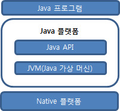
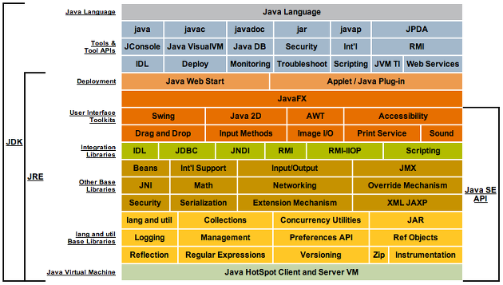

# 최상현 202030138

## 4주차 수업 내용
1. 실수 리터럴
    * 실수 리터럴은 double 타입으로 자동 처리됨.
    * 아래와 같이 숫자뒤에 f나 d를 붙여 float타입이나 double타입으로 강제 변환 가능.
    ```java
    float f = 0.1234f;
    ```
2. 문자 리터럴
    * 주로 ' ' 안에 사용
    * \uae00으로 유니코드 값으로도 사용 가능
3. 특수 문자 리터럴
    * \b - 백스페이스
    * \t - 탭
    * \n - 라인피드
    * \f - 폼피드
    * \r - 캐리지 리턴
    * \" - 이중 인용부호
    * \' - 단일 인용부호
    * \\\ - 백슬래시
4. 논리 타입 리터럴
    * true와 false
5. null 리터럴 - null 값은 객체 레퍼런스에만 사용 가능(기본 타입에서 사용 불가능)
    * *문자열 String은 기본 타입이 아님*
6. var 키워드 - var 키워드 사용 시 타입 생략 가능(자동 지정, 하지만 반드시 초기값을 주어줘야함.)
7. final 키워드 - 상수로 선언하고, 값을 변환하지 않을 때 사용
8. 타입 변환
    1. 자동 타입 변환 - 작은 타입에서 큰 타입으로 넘길 때 자동으로 타입이 변환됨.(ex. long > double)
    2. 강제 타입 변환 - 큰 타입에서 작은 타입으로 넘기면 강제로 타입을 변환 시켜줘야됨.
    ```java
    int n = 300;
    byte b = (byte)n;
    ```
9. Scanner(System.in)
    * java.util.Scanner를 임포트 시켜줘야 사용가능
    ```java
    import java.util.Scanner;
    ```
    * Scanner 객체를 먼저 생성하여 선언해주어야함.
    ```java
    Scanner scanner = new Scanner(System.in);
    ```
    * Scanner는 공백을 기준으로 토큰 단위로 읽어들인다. 아래 문장에서 최상현 24라고 입력하면 각각 name과 age에 "최상현"과 24가 입력됨.
    ```java
    String name = scanner.next();
    int age = scanne.nextInt();
    ```
    * 문자열을 제외한 다른 기본 타입을 받을경우 뒤에 타입을 지정해주어야 함.
    ```java
    String name = scanner.next();
    int age = scanner.nextInt();
    double point = scanner.nextDouble();
    float fpoint = scanner.nextFloat();
    ```
    * scanner를 다 쓰고 난 다음에는 꼭 scanner.close();로 스캐너를 종료시켜줄 것.
10. 연산자
    1. 증감: ++, --
    2. 산술: +, -, *, /, %
    3. 시프트: >>, <<, >>>
    4. 비교: <, >, <=, >=, ==, !=
    5. 비트: &, |, ^, ~
    6. 논리: &&, ||, !, ^
    7. 조건: ?, :
    8. 대입: =, *=, /=, +=, -=, &=, ^=, !=, <<= ,>>=, >>>=
11. 증감 연산 시 주의할 점
    ```java
    int a = 1;
    int b = ++a;
    ```
    **a에다 1을 더해서 a를 2로 만들고 b에다 대입**
    ```java
    int a = 1;
    int b = a++;
    ```
    **a를 b에다 넣고 a에다 1을 더해서 a를 2로 만듬**
12. 대입 연산
    'a (연산자)= b'로 표현하고 a에다 a 와 b를 (연산자)해서 값을 대입한다.
13. 논리 연산자
    * !a - NOT 연산
    * a ^ b - XOR 연산(한개만 참이면, 둘이 다르면 true)
    * a || b - OR연산(한개라도 참이면 true)
    * a && b - AND연산(둘다 참이면 true)
    * 비교 연산 사용 시 주의할 점
        * '20 <= a < 30'을 표현하려면 '20 <= a && a < 30'로 표현
14. 조건 연산 - '조건 ? true : false' - 조건이 참이면 true를 거짓이면 false로 실행
15. 시프트 연산
    * a>>b - a를 화살표 방향대로 b번 시프트(최상위 비트는 원래 최상위 비트대로 따라감)
    * a<<b - a를 화살표 방향대로 b번 시프트(맨 오른쪽 비트는 0으로 대체)
    * a>>>b - a를 화살표 방향대로 b번 시프트(최상위 비트는 0으로 대체)
16. 조건문
    * condition이 참이면 first() 실행. condition2가 참이면 second() 실행. 그게 아니면 third() 실행
    ```java
    if(condition) {
        first();
    }
    else(condition2) {
        second();
    }
    else {
        third();
    }
    ```
17. switch 문
    * 각 arihte의 값에 따라 각 case에 맞게 실행. switch문에는 항상 각 case마다 break를 해줘야 switch문을 탈출 할 수 있으며, 어느것과도 같지 않는 경우가 발생할 수 있기 때문에 default 케이스를 만들어줘야함.
    ```java
    switch(arithe) {
        case one:
            one();
            break;
        case two:
            two();
            break;
        case three:
            three();
            break;
        default:
            break;
    }
    ```
18. for 문(횟수가 정해져 있을 때)
    * i는 1부터 10이 되기전까지 1씩 더하며 반복
    ```java
    for (int i = 1; i < 10; i++) {
        System.out.println(i);
    }
    ```
19. while문(횟수가 정해져 있지 않을 때)
    * 조건식이 true면 작업문 수행 후 다시 조건식 심사
    ```java
    while(조건식){
        작업문
    }
    ```
20. do-while 문
    * 일단 do의 작업문을 하고, 조건식을 심사 true면 작업문 다시 수행
    ```java
    do{
        작업문
    } while(조건식)
    ```
21. continue문 - 반복문에서 continue;를 만나면 즉시 조건식을 심사후 원래 절차대로 수행
22. break문 - 반복문에서 break;를 만나면 즉시 반복문 탈출
23. 배열
    * 배열 - 인덱스와 인덱스에 대응하는 일련의 데이터들(연속적인 자료구조)
    * int i[] - 배열의 레퍼런스 변수 선언
    * i[] = new int[10]; - i라는 레퍼런스 변수에 10개의 배열 공간 할당.
24. 


## 3주차 수업 내용(03.22)
1. 고급 언어와 저급 언어
    * 저급 언어 - 기계어(01010001011...), 어셈블리어(ADD, SUB, MOVE...)
    * 고급 언어 - C, C++, C#, JAVA 등
        * *고급 언어는 절차 지향 언어와 객체 지향 언어로 구분된다.*
2. 컴파일
    * .java, .c, .cpp >>>(컴파일)>>> .exe, .class
3. 자바의 플랫폼 독립성(WORA)
    * WORA(Write Once Run Anywhere) - 자바 가상 기계(JVM) 덕분에 **한 번 작성하고 컴파일된 자바 코드는 운영체제나 CPU 등 플랫폼에 상관 없이** 어떤 컴퓨터에서든 동일하게 실행됨.
    * 플랫폼 독립적 특징 - 개발자 입장에서 소프트웨어를 개발할 때 플랫폼에 독립적이지 않다면 각각의 플랫폼들마다 소프트웨어를 일일이 하나씩 만들어줘야함.<br>
4. JDK(Java Development Kit)와 JRE(Java Runtime Environment)
    * JDK는 개발자를 위한 소프트웨어, JRE는 사용자를 위한 소프트웨어
    * JDK 안에 JRE가 포함되어 있으며 JRE 안에 후술할 JAVA API가 포함되어 있음.<br>
5. 모듈화
    * 모듈 - 자바 패키지들과 여러 파일들을 묶은 단위
    * 모듈들은 jmods 디렉터리 안에 포함
    * 세밀한 모듈화를 통해 자바 응용프로그램이 실행되는데 필요 없는 모듈을 배제하여 작은 크기로 배포할 수 있도록 함에 있다.
6. 자바 API(Application Programming Interface)
    * JDK에 포함된 클래스 라이브러리
    * 이 API들을 이용하여 쉽고 효율적이며 다양한 기능들을 구현할 수 있음.
    * 비슷한 기능의 클래스들끼리 묶어 패키지로 구현
7. IDE(Integrated Development Environment) - 소스 코드 편집, 컴파일, 디버깅을 전부 할 수 있는 소프트웨어 통합 개발 환경(Java의 경우 Eclipse)
8. 객체 지향 언어 - 캡슐화, 상속, 다형성 등을 가능하게 함.(굉장히 중요)
9. 클래스로 캡슐화
    * 자바는 객체 지향 언어의 캡슐화 원칙을 철저히 지켜 **변수나 메서드는 반드시 클래스 내**에 구현하도록 함.
    * 하나의 자바 소스 파일에 여러 개의 클래스를 작성한 경우 컴파일 시, 클래스마다 별도의 클래스 파일이 생성된다.
10. 실행 코드 배포 - 자바 응용프로그램은 다수의 클래스 파일로 구성되지만 자바의 실행은 main() 메서드에서 시작됨.
11. 가비지 컬렉션 - 자바에 메모리를 할당받는 기능은 있지만 메모리를 반환하는 기능이 없다. 따라서 이러한 메모리의 반환을 시켜주는 기능이 가비지 컬렉션.
12. 클래스
    ```java
    public class HelloWorld {

    }
    ```
13. 메인 메서드 - static은 프로그램의 시작과 끝 동안 메모리에 존재, void는 반환값이 없음을 의미
    ```java
    public static void main(String[] args) {

    }
    ```
14. 주석
    ```java
    // 이것은 주석으로써 컴파일에 영향을 미치지 않는 문장입니다.
    ```
15. 메서드 선언
    * C++에서의 함수, 자바 특성상 반드시 클래스 내부에 작성해야함.
    * int는 정수 자료형을 반환하고, sum은 메서드의 이름이며, ()안은 매개변수이다. 반환값이 있기 때문에 반드시 return으로 반환을 해주어야함.
    ```java
    public int sum(int n, int m){
        return n + m;
    }
    ```
16. 메서드 호출
    ```java
    result = sum(4,6);   //결과값으로 10이 나올 것이다.
    ```
17. 화면 출력 - println은 캐리지리턴과 뉴라인을 해준다.(사실 라인 하나를 차지하는 의미) print 역시 사용 가능
    ```java
    System.out.println("Hello");
    ```
18. 식별자 이름 규칙
    1. 특수문자sms '_'와 '$'만 가능하다.
    2. 한글 사용 가능(하지만 나라면 절대 안씀.)
    3. 자바 언어 키워드(if, while, for) 금지
    4. 처음은 숫자로 시작 금지
    5. boolean값이나 null 금지
    6. 대소문자 구별
    7. 길이 제한 당연히 없음.
19. 기본 타입
    * boolean - 1비트
    * char - 2바이트
    * byte - 1바이트
    * short - 2바이트
    * int - 4바이트
    * long - 8바이트
    * float - 4바이트
    * double - 8바이트
20. 문자열 - String은 클래스로써 기본 자료형이 아님.
    * 사용 - '+' 연산자를 사용하여 변수나 실수와 연결한다.
21. 변수 선언 - (데이터 타입) (변수 이름);
22. 정수 리터럴(값이라고 생각하면 편함.)
    * 10진수 - 우리 숫자
    * 8진수 - 0으로 시작
    * 16진수 - 0x로 시작
    * 2진수 - 0b로 시작
    


## 2주차 수업내용(03.15)
git과 관련 내용 공부<br>
- LICENSE(법적 내용)
- .gitignore의 기능(업로드하지 않을 파일들을 설정 가능)
- README 파일에선 최근 내용을 먼저 볼 수 있게 만들 것
- Git Graph에서 add Tag를 통해 버전을 추가할 수 있으며, origin은 GitHub에 존재함.(근본 그 자체) 하지만 push를 하게되면 main과 github(Origin)이 같은 위치에 존재하게 된다.
- 확실히 VS Code의 확장 기능을 통해 Git과의 사용성도 고려하였을 때 IDE 를 굳이 Eclipse를 사용해야 하나에 대해 다시 생각해봄.