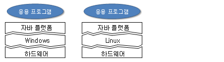
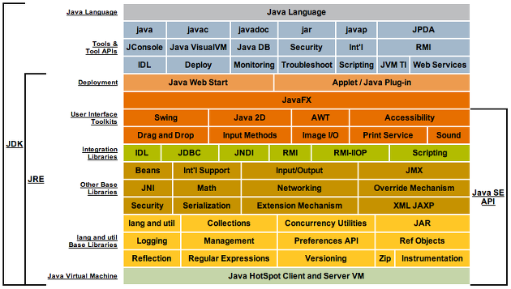

# 최상현 202030138

## 3주차 수업 내용(03.22)
1. 고급 언어와 저급 언어
    * 저급 언어 - 기계어(01010001011...), 어셈블리어(ADD, SUB, MOVE...)
    * 고급 언어 - C, C++, C#, JAVA 등
        * *고급 언어는 절차 지향 언어와 객체 지향 언어로 구분된다.*
2. 컴파일
    * .java, .c, .cpp >>>(컴파일)>>> .exe, .class
3. 자바의 플랫폼 독립성(WORA)
    * WORA(Write Once Run Anywhere) - 자바 가상 기계(JVM) 덕분에 **한 번 작성하고 컴파일된 자바 코드는 운영체제나 CPU 등 플랫폼에 상관 없이** 어떤 컴퓨터에서든 동일하게 실행됨.
    * 플랫폼 독립적 특징 - 개발자 입장에서 소프트웨어를 개발할 때 플랫폼에 독립적이지 않다면 각각의 플랫폼들마다 소프트웨어를 일일이 하나씩 만들어줘야함.<br>
4. JDK(Java Development Kit)와 JRE(Java Runtime Environment)
    * JDK는 개발자를 위한 소프트웨어, JRE는 사용자를 위한 소프트웨어
    * JDK 안에 JRE가 포함되어 있으며 JRE 안에 후술할 JAVA API가 포함되어 있음.<br>
5. 모듈화
    * 모듈 - 자바 패키지들과 여러 파일들을 묶은 단위
    * 모듈들은 jmods 디렉터리 안에 포함
    * 세밀한 모듈화를 통해 자바 응용프로그램이 실행되는데 필요 없는 모듈을 배제하여 작은 크기로 배포할 수 있도록 함에 있다.
6. 자바 API(Application Programming Interface)
    * JDK에 포함된 클래스 라이브러리
    * 이 API들을 이용하여 쉽고 효율적이며 다양한 기능들을 구현할 수 있음.
    * 비슷한 기능의 클래스들끼리 묶어 패키지로 구현
7. IDE(Integrated Development Environment) - 소스 코드 편집, 컴파일, 디버깅을 전부 할 수 있는 소프트웨어 통합 개발 환경(Java의 경우 Eclipse)
8. 객체 지향 언어 - 캡슐화, 상속, 다형성 등을 가능하게 함.(굉장히 중요)
9. 클래스로 캡슐화
    * 자바는 객체 지향 언어의 캡슐화 원칙을 철저히 지켜 **변수나 메서드는 반드시 클래스 내**에 구현하도록 함.
    * 하나의 자바 소스 파일에 여러 개의 클래스를 작성한 경우 컴파일 시, 클래스마다 별도의 클래스 파일이 생성된다.
10. 실행 코드 배포 - 자바 응용프로그램은 다수의 클래스 파일로 구성되지만 자바의 실행은 main() 메서드에서 시작됨.
11. 가비지 컬렉션 - 자바에 메모리를 할당받는 기능은 있지만 메모리를 반환하는 기능이 없다. 따라서 이러한 메모리의 반환을 시켜주는 기능이 가비지 컬렉션.
12. 클래스
    ```java
    public class HelloWorld {

    }
    ```
13. 메인 메서드 - static은 프로그램의 시작과 끝 동안 메모리에 존재, void는 반환값이 없음을 의미
    ```java
    public static void main(String[] args) {

    }
    ```
14. 주석
    ```java
    // 이것은 주석으로써 컴파일에 영향을 미치지 않는 문장입니다.
    ```
15. 메서드 선언
    * C++에서의 함수, 자바 특성상 반드시 클래스 내부에 작성해야함.
    * int는 정수 자료형을 반환하고, sum은 메서드의 이름이며, ()안은 매개변수이다. 반환값이 있기 때문에 반드시 return으로 반환을 해주어야함.
    ```java
    public int sum(int n, int m){
        return n + m;
    }
    ```
16. 메서드 호출
    ```java
    result = sum(4,6);   //결과값으로 10이 나올 것이다.
    ```
17. 화면 출력 - println은 캐리지리턴과 뉴라인을 해준다.(사실 라인 하나를 차지하는 의미) print 역시 사용 가능
    ```java
    System.out.println("Hello");
    ```
18. 식별자 이름 규칙
    1. 특수문자sms '_'와 '$'만 가능하다.
    2. 한글 사용 가능(하지만 나라면 절대 안씀.)
    3. 자바 언어 키워드(if, while, for) 금지
    4. 처음은 숫자로 시작 금지
    5. boolean값이나 null 금지
    6. 대소문자 구별
    7. 길이 제한 당연히 없음.
19. 기본 타입
    * boolean - 1비트
    * char - 2바이트
    * byte - 1바이트
    * short - 2바이트
    * int - 4바이트
    * long - 8바이트
    * float - 4바이트
    * double - 8바이트
20. 문자열 - String은 클래스로써 기본 자료형이 아님.
    * 사용 - '+' 연산자를 사용하여 변수와 연결한다.


## 2주차 수업내용(03.15)
git과 관련 내용 공부<br>
- LICENSE(법적 내용)
- .gitignore의 기능(업로드하지 않을 파일들을 설정 가능)
- README 파일에선 최근 내용을 먼저 볼 수 있게 만들 것
- Git Graph에서 add Tag를 통해 버전을 추가할 수 있으며, origin은 GitHub에 존재함.(근본 그 자체) 하지만 push를 하게되면 main과 github(Origin)이 같은 위치에 존재하게 된다.
- 확실히 VS Code의 확장 기능을 통해 Git과의 사용성도 고려하였을 때 IDE 를 굳이 Eclipse를 사용해야 하나에 대해 다시 생각해봄.